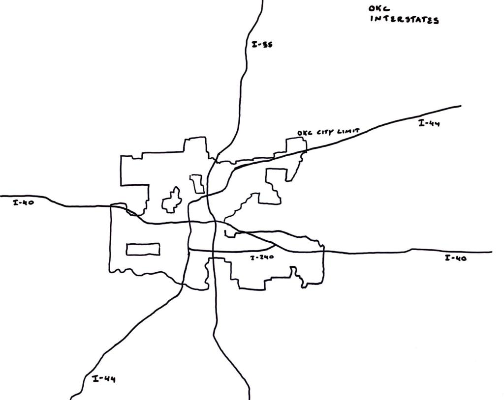
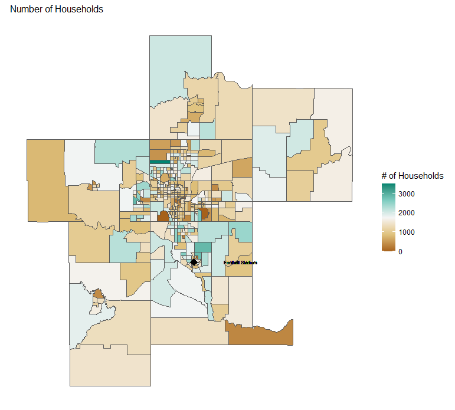
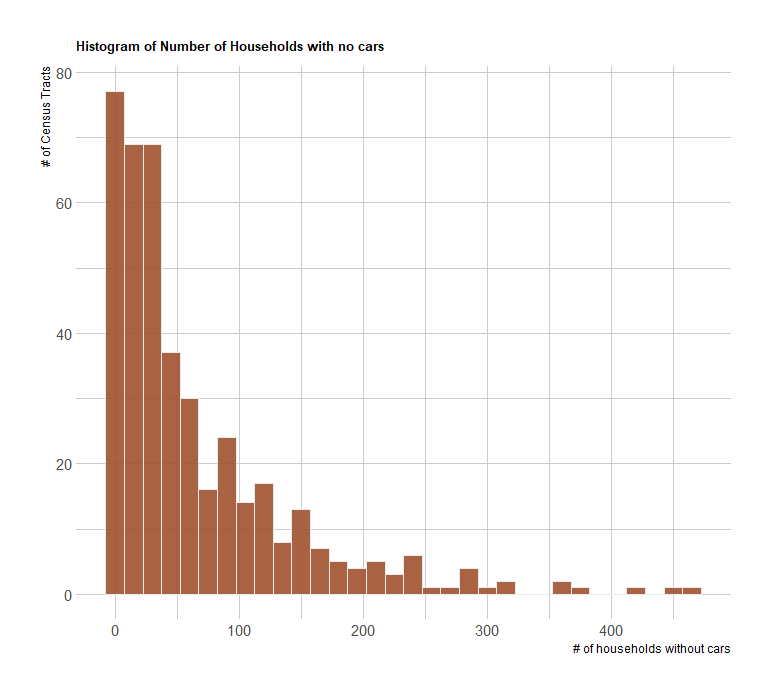
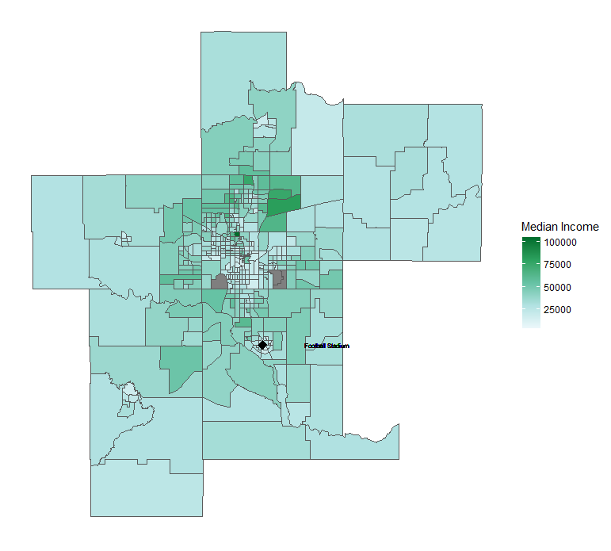
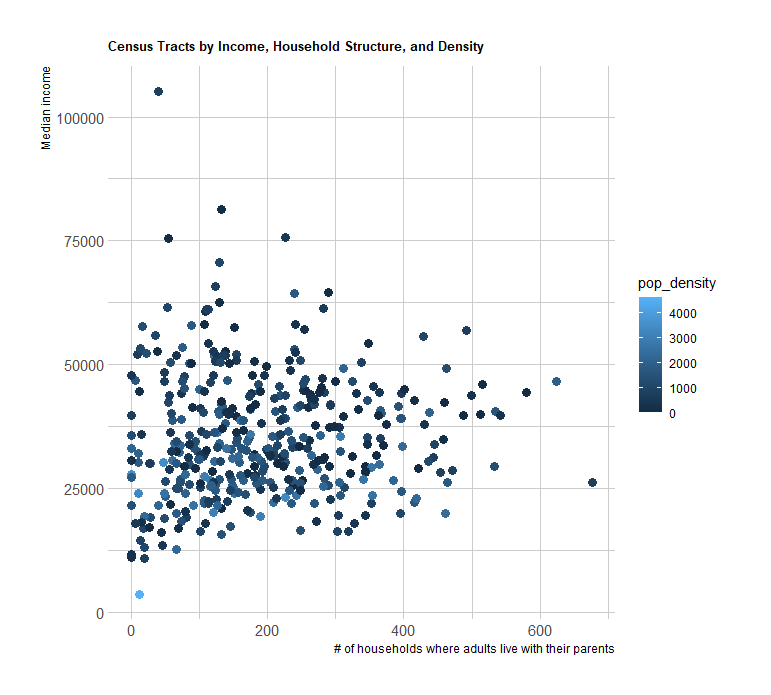
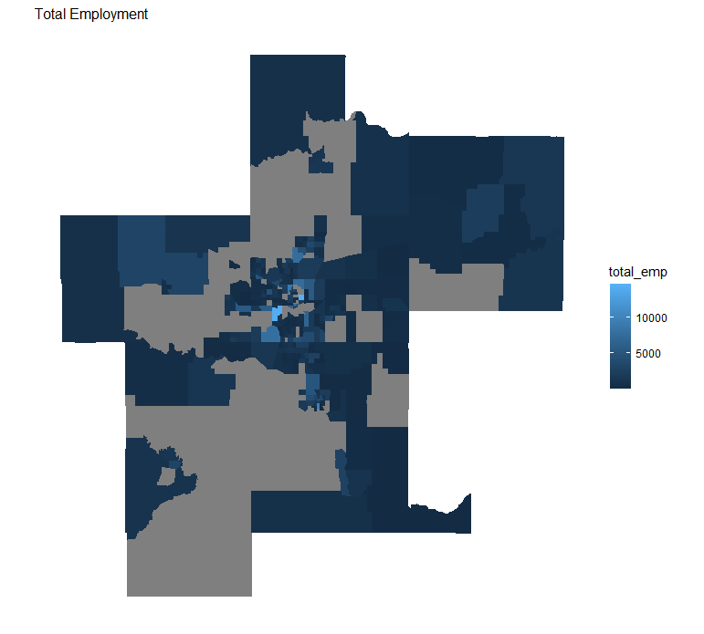
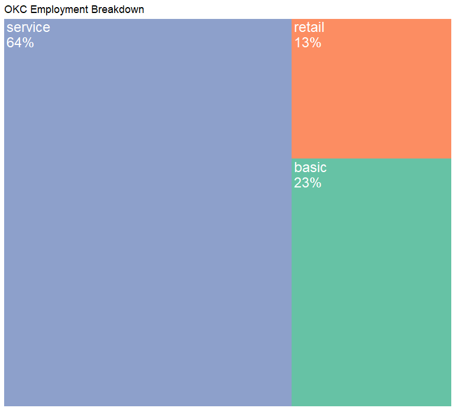
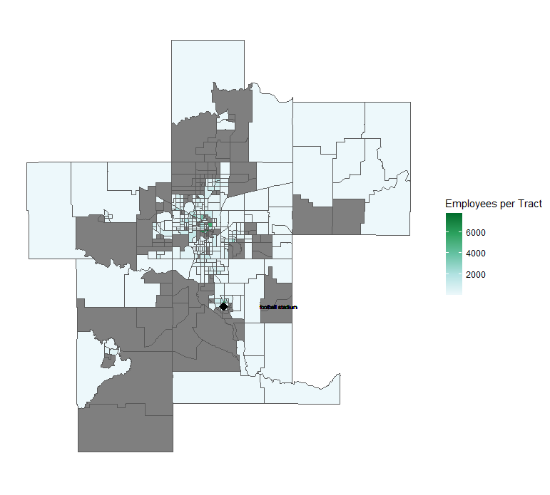
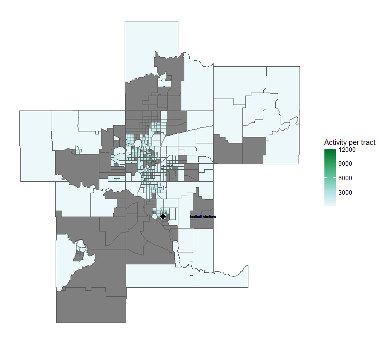

**Nur Shlapobersky**

**Sage Voorhees**

# Introduction

Oklahoma City is the capital of Oklahoma and the largest city in the state. At the 2020 Census, the OKC Metro area had a population just shy of 1.5 million (1,425,695)   (Census, 2020). 

In the 2021 American Community Survey (ACS), 62% of respondents reported their race as white, 10% African American, 8% Multiracial, 3% Native American, 3% Asian, 1% other (ACS 2018). 14% reported identifying as Hispanic (ACS 2018). Some well-known neighborhoods in OKC include Downtown, Bricktown (entertainment district), Deep Deuce (residential, formerly an African American neighborhood), The Arts District, Film Row, Midtown, Automobile Alley, Plaza District, Cottage District, Uptown, Asian District, Paseo Arts District, Crown-Heights-Edgemere Heights, Western Avenue Corridor, and 39th Street Enclave. 

Three major interstates--I-35, I-40, and I-44 all pass through OKC. 

{width=75%}

# Census and Employment Visualizations

## Household Characteristics

## Employment

## Density Maps

