**Nur Shlapobersky** + **Sage Voorhees**  
SES 5394: Travel Behavior and Forecasting  
Spring Semester 2023  

# **Oklahoma City at a Glance**
<center>
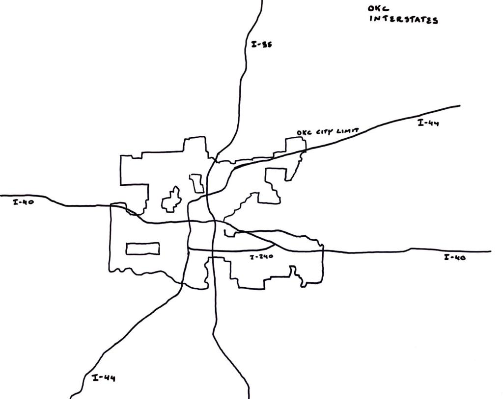{width=75%}
</center>

Oklahoma City is the capital of Oklahoma and the largest city in the state. At the 2020 Census, the OKC Metro area had a population just shy of 1.5 million people (Census, 2020). In the 2021 American Community Survey (ACS), 62% of respondents reported their race as white, 10% African American, 8% Multiracial, 3% Native American, 3% Asian, 1% other (ACS 2018). 14% reported identifying as Hispanic (ACS 2018). Some well-known neighborhoods in OKC include Downtown, Bricktown (entertainment district), Deep Deuce (residential, formerly an African American neighborhood), The Arts District, Film Row, Midtown, Automobile Alley, Plaza District, Cottage District, Uptown, Asian District, Paseo Arts District, Crown-Heights-Edgemere Heights, Western Avenue Corridor, and 39th Street Enclave. Three major interstates--I-35, I-40, and I-44 all pass through OKC. 


# **Elements of the Model**
## Four Step Model
We are using for this analysis a classic four-step model. Because this is a student assignment with limited capacity, we are using various shortcuts throughout the model that will be identified. Shortcomings with the way we have modeled transportation do not necessarily reflect shortcomings of the four-step model. 

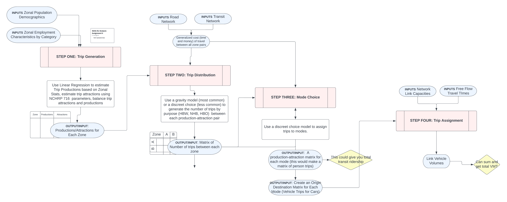{width=100%}


## Transit Analysis Zones
Our transportation analysis looks at 419 transit analysis zones across 7 counties, each corresponding to a census tract. In Figure 2 we can see that Oklahoma City follows a typical greater metropolitan area pattern with a dense and active urban core, surrounded by suburbs and rural areas. 

<center>
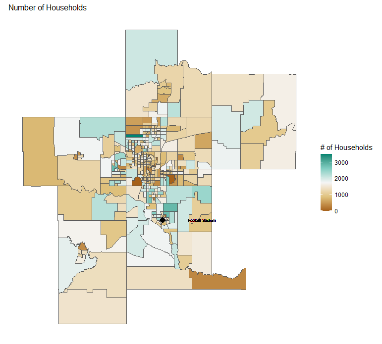{width=55%}
</center>

## Road Network 

The longest distance between zones by car was just over 3 hours and 15 minutes (190.5 minutes). The shortest distance was half a minute (0.5 minutes). The average distance between TAZ centroids is roughly 30 minutes (30.7), the median time is around 25 minutes (25.6 minutes).

<center>
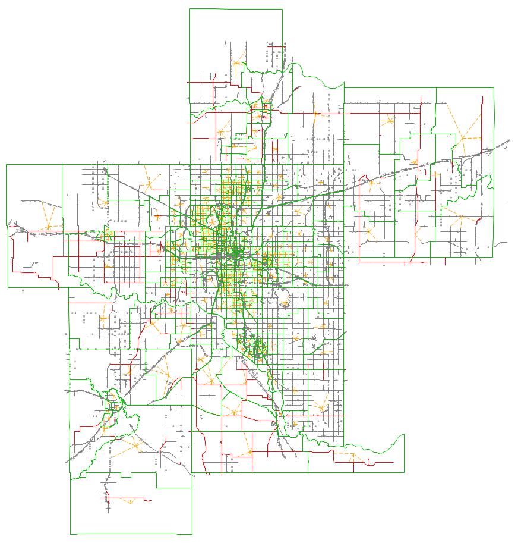{width=60%} 
</center>

## Public Transit Network
The OKC Transit network is composed of 651 miles of bus routes, across 30 different bus lines. The map below shows the bus network in detail, and in the context of the whole city. Of our 419 transit analysis zones for OKC metro area, the transit network connects only 135 of those zones, with the longest travel time between zones being just over 3 hours and 15 minutes (190.5 minutes). The shortest distance was half a minute (0.5 minutes). The average distance between centroids is roughly 30 minutes (30.7). The median time between centroids was around 25 minutes (25.6 minutes). The public transit is fully contained in 3 of the 7 counties that make up the OKC statistical area. 

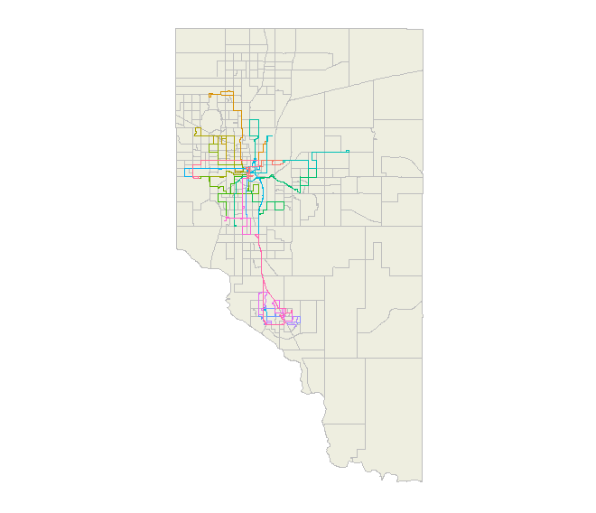{width=70%}
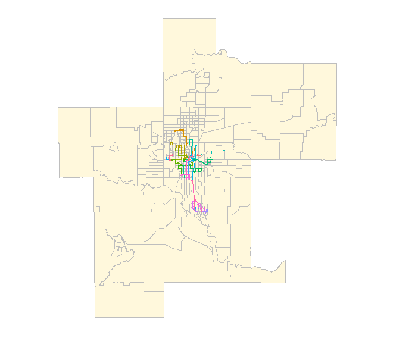{width=25%}
<center> **Fig 4**: OKC Public Transit </center>

## Travel Times
Using the networks we created, we generated travel time skims which provide travel times between every TAZ. By selecting a subset we can map every zone's travel time by car to the University of Oklahoma, as in Figure 5.

<center>
{width=60%} 
</center>

As well as the travel time by bus from the University to other zones, as in Figure 6 (note that many are grayed out because they cannot be reached by bus).

<center>
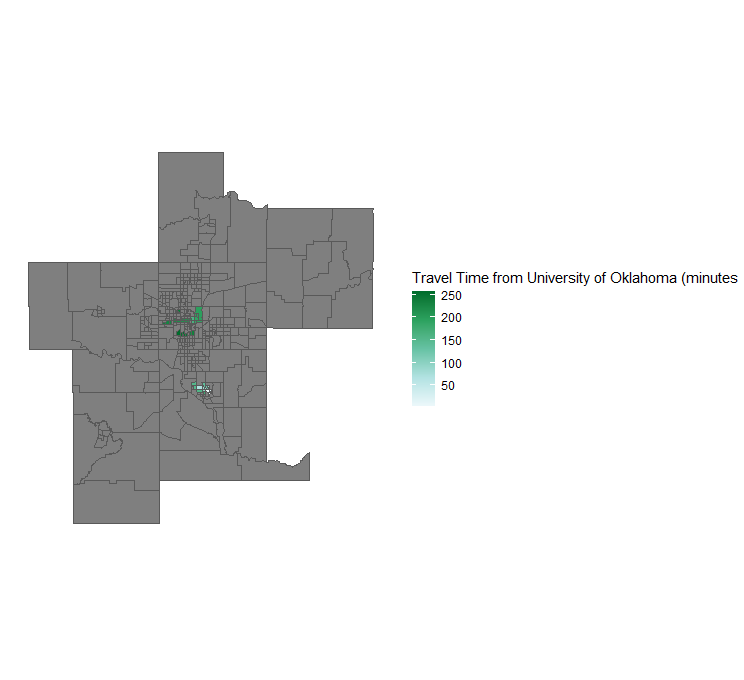{width=60%}
</center>

# **Accessibility**

**Accessibility** is a measure of how many destination travelers can reach within a *perceived* reasonable time using transportation modes available to them. Put an alternative, and slightly more mathematical way:

> **accessibility** = **mobility** (reasonable reachable area) x **proximity** (opportunities / area)

We determine accessibility based on the network skims mentioned earlier and employment data. Travel times are used in a decay function to scale the "worth" of each opportunity, and these are all summed together to determine the accessibility score. See Appendix B for more information.

## Accessibility by Car
Car access is distributed as is typical for a metropolitan area: the downtown, being both dense and centrally located, has higher scores than the outlying areas. 

<center>
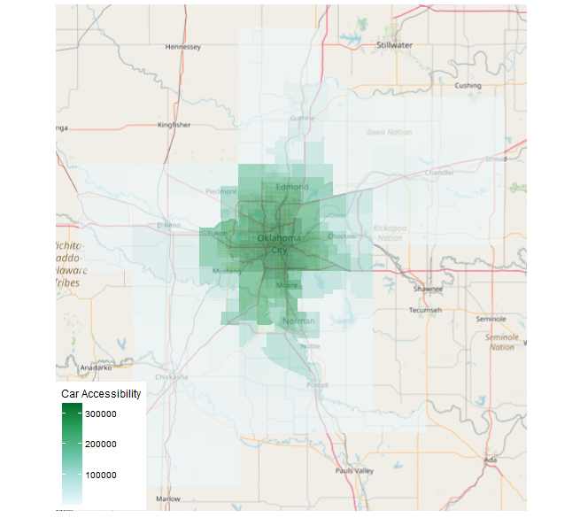
</center>

While they don't necessarily represent a large percent of the land area, there are many of those downtown high-scoring zones because they are smaller, and this is what forms the right peak in the distribution shown in Figure 8. The left peak represents the outlying rural zones.

<center>
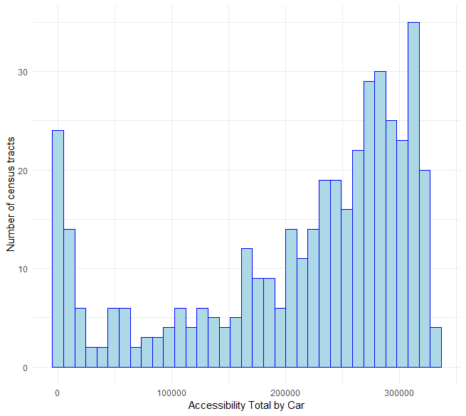
</center>

## Accessibility by Transit
Transit in Oklahoma City is quite limited to the areas in and around Downtown and the University campus. The bus lines between the two areas notably bypass most of the zones in between, creating the two island-like regions in Figure 9.

<center>

</center>

Taking a look at the accessibility map without using a log transformation in Figure 10, we can see that the majority of those zones have very similar low scores. There are just a few outliers with much higher accessibility scores due to the proximity of transit hubs where many of the bus lines meet.

<center>
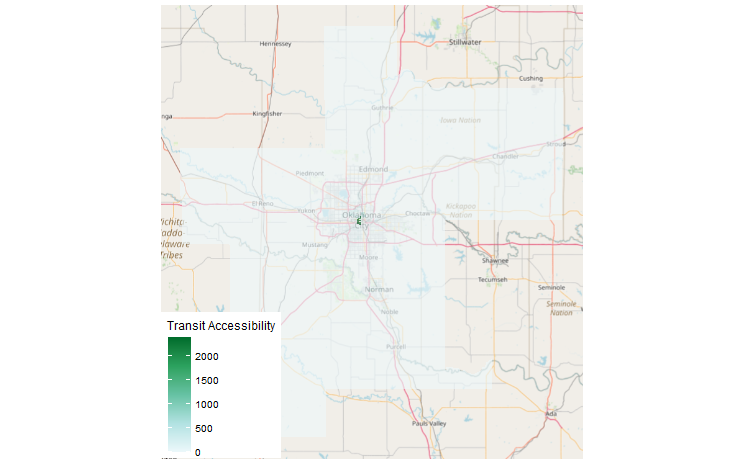
</center>

Those outliers can also be seen in Figure 11 at the far right tail of the distribution.  

<center>

</center>

# **Trip Attractions and Trip Productions** 


**Estimating Productions and Attractions** 
Data for our analysis of Trip Attractions and Productions comes from the National Household Travel Survey (NHTS) from 2017. 

To generate Trip Attractions and Trip Productions for each transit analysis zones, we broke up trip types into three main categories. 

1. Home Based Work: Travel between work and home 
2. Home Based Other: Travel between home and places other than a workplace
3. Non-Home Based: Travel that does not start or end at home

To generate our trip attractions and productions we conducted a linear regression using factors present in both the NHTS and the ACS. 

We used: 


  1. Median Income (Continuous)
  2. Whether or not the household had a vehicle (yes, no)
  3. Household size (1 person, 2 people, 3 people, 4 or more people)
  4. Whether or not the household had kids (yes, no)
  
We had a very low R-Squared value in our regressions ranging from .124 to .129. In our regressions, only household size and presence of kids was statistically significant, so we only used these variables to generate trip attractions and productions. 

#### Totals for Trip Productions and Attractions
**Home Based Work:** 124,464  
**Home Based Other:** 1,392,300  
**Non Home Based:** 1,618,000  


<center>
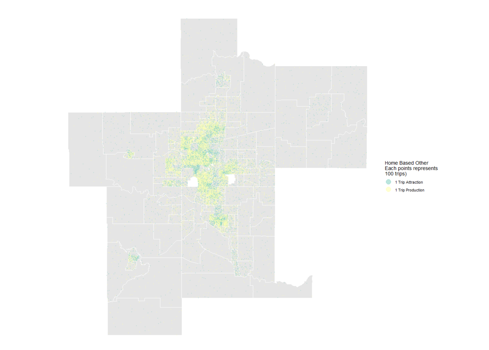
</center>


<center>
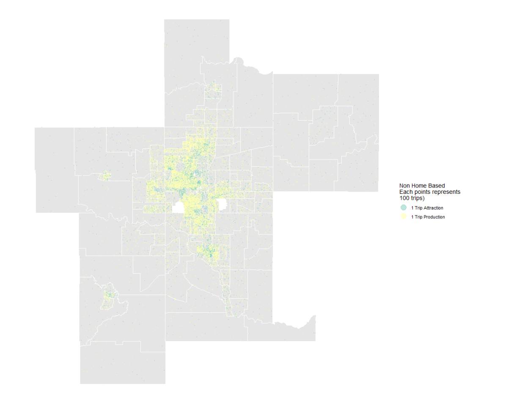
</center>

We also used NHTS data to examine mode share in OKC based on various trip types. 

<center>
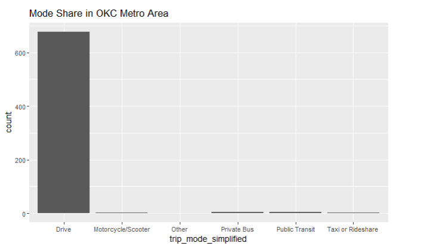
</center>

<center>
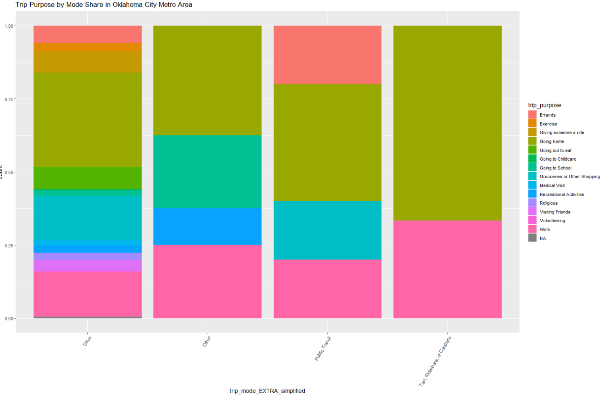
</center>

<center>
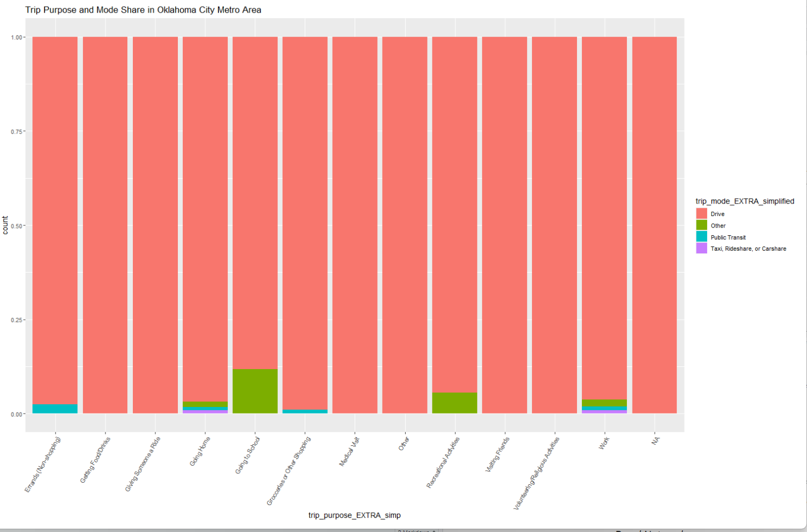
</center>

# **Gravity Model**

```{r, echo=FALSE, include=F}
library(here)
library(tidyverse)
library(sf)
library(survey)
library(srvyr)
library(od)
library(ggspatial)
library(knitr)
library(readxl)
library(tigris)
library(scenRios)
library(devtools)
library(chorddiag)
library(RColorBrewer)

OKC_CBSA <- "36420" #OKC

#### Import NHTS travel data by purpose ####
# trips <- read_csv(here("data", "nhts", "trippub.csv"), show_col_types = FALSE) %>%
 trips <- read_csv(here("data", "NHTS_csv", "trippub.csv"), show_col_types = FALSE) %>%
  filter(HH_CBSA == OKC_CBSA) %>%
  filter(TRPTRANS == "03" | # Car
         TRPTRANS == "04" | # SUV
         TRPTRANS == "05" | # Van
         TRPTRANS == "06") # pickup truck

# Recode based on trip type
trips <- trips %>%
  mutate(home_based = case_when(WHYTO == "01" ~ TRUE,
                                WHYTO == "02" ~ TRUE,
                                WHYFROM == "01" ~ TRUE,
                                WHYFROM == "02" ~ TRUE,
                                TRUE ~ FALSE)) %>%
  mutate(work = ifelse(WHYTO == "03" | WHYFROM == "03", TRUE, FALSE)) %>%
  mutate(purpose = case_when(home_based & work ~ "HBW",
                             home_based ~ "HBO",
                             TRUE ~ "NHB"))

# Create a survey object
trips_svy <- trips %>%
  filter(TRVLCMIN > 0) %>%
  as_survey(weights = WTTRDFIN)

ttime_by_purpose <- trips_svy %>%
  group_by(purpose) %>%
  summarise(avg_time = survey_mean(TRVLCMIN))

#### Import skim and trip generation data ####
# Convert from centroids to GEOIDs
# 
# other_dict <- zone_data %>%
#   select(centroid_id, GEOID) %>%
#   rename(centroid=centroid_id)
# 
# car_centroid_dict <- read_csv(here("data", "car_centroids.csv")) %>%
#   select(ID, Centroid) %>%
#   rename(geoid=ID) %>%
#   rename(centroid=Centroid) %>%
#   left_join(other_dict) #%>%
#   # select(centroid, GEOID) %>%
  # rename(geoid=GEOID)
# 
# match_geoid <- function(v, dict) {
#   sapply(v, function(id) {
#     # row <- dict[dict$centroid_id,]
#     # row$GEOID
#     dict$geoid[id]
# 
#   })
# }
# 
# skim <- read_csv(here("data", "okc_full_skim.csv")) %>%
#   mutate(Origin=match_geoid(Origin, car_centroid_dict)) %>%
#   mutate(Destination=match_geoid(Destination, car_centroid_dict))
# 
# write_csv(skim, here("data", "okc_full_skim_GEOID.csv"))
# write_csv(car_centroid_dict, here("data", "full_geoid_centroid_dict.csv"))

skim <- read_csv(here("data", "okc_full_skim_geoid.csv"))
trip_gen <- st_read(here("data", "trip-gen.geojson")) %>%
  mutate(hbo_trip_prod=replace(hbo_trip_prod, hbo_trip_prod < 0, 0))

#### Balancing ####
# Add friction factors
skim <- skim %>%
  filter(!is.na(car_time)) %>%
  select(Origin, Destination, car_time) %>%
  mutate(Origin = as.character(Origin)) %>%
  mutate(Destination = as.character(Destination)) %>%
  rename(from_GEOID=Origin) %>%
  rename(to_GEOID=Destination)

skim <- skim %>%
  mutate(F_HBO = car_time^-3) %>%
  mutate(F_HBW = car_time^-0.5) %>%
  mutate(F_NHB = car_time^-2.9)

# Exponential friction factor
# skim <- skim %>%
#   mutate(F_HBO = exp(-16.30407 * car_time)) %>%
#   mutate(F_HBW = exp(-26.10191 * car_time)) %>%
#   mutate(F_NHB = exp(-15.94483* car_time))

# Run Carole's tool
HBO_dist <- grvty_balancing(od_zones = trip_gen,
                            friction = skim,
                            zone_id = "GEOID",
                            zone_o = "hbo_trip_prod",
                            zone_d = "hbo_bal_attr",
                            friction_o_id = "from_GEOID",
                            friction_d_id = "to_GEOID",
                            friction_factor = "F_HBO",
                            tolerance = 0.01,
                            max_iter = 10000)

tail(HBO_dist$convergence)

HBW_dist <- grvty_balancing(od_zones = trip_gen,
                            friction = skim,
                            zone_id = "GEOID",
                            zone_o = "hbw_trip_prod",
                            zone_d = "hbw_bal_attr",
                            friction_o_id = "from_GEOID",
                            friction_d_id = "to_GEOID",
                            friction_factor = "F_HBW",
                            tolerance = 0.01,
                            max_iter = 10000)

tail(HBW_dist$convergence)

NHB_dist <- grvty_balancing(od_zones = trip_gen,
                            friction = skim,
                            zone_id = "GEOID",
                            zone_o = "nhb_trip_prod",
                            zone_d = "nhb_bal_attr",
                            friction_o_id = "from_GEOID",
                            friction_d_id = "to_GEOID",
                            friction_factor = "F_NHB",
                            tolerance = 0.01,
                            max_iter = 10000)

tail(NHB_dist$convergence)

HBO_flows <- HBO_dist$flows %>%
  rename(from_GEOID = o_id,
         to_GEOID = d_id,
         HBO_flow = flow)

HBW_flows <- HBW_dist$flows %>%
  rename(from_GEOID = o_id,
         to_GEOID = d_id,
         HBW_flow = flow)

NHB_flows <- NHB_dist$flows %>%
  rename(from_GEOID = o_id,
         to_GEOID = d_id,
         NHB_flow = flow)

skim <- skim %>%
  left_join(HBO_flows) %>%
  left_join(HBW_flows) %>%
  left_join(NHB_flows)

sum(skim$HBO_flow * skim$car_time) / sum(skim$HBO_flow)
sum(skim$HBW_flow * skim$car_time) / sum(skim$HBW_flow)
sum(skim$NHB_flow * skim$car_time) / sum(skim$NHB_flow)
```

## Calibrating the Model with Friction Functions
To build our gravity model and calculate our trip attraction/production matrix, we first had to choose friction functions for all three trip types. We chose to use power functions, with coefficients adjusted to cause our model's average travel times to match the NHTS travel data.

For home-based work trips, our function was
$friction = travelTime^{-3}$

For home-based other trips, the function was
$friction = travelTime^{-0.5}$

For non-home-based trips, the function was
$friction = travelTime^{-2.9}$


This produced average travel times that closely matched observed data, as shown in Figure 17.

<center>
| Trip Type | Observed Average | Model Average |
| :-: | :-: | :-: |
| Home-Based Work  | 26.1019 | 26.1546 |
| Home-Based Other | 16.3041 | 16.3455 |
| Non-Home-Based   | 15.9448 | 15.8869 |
**Figure 17**: Comparison of survey data averages and model averages.
</center>

## Illustrating Travel Flows

We can see that the single county which generates the most trips by far (across all three types) originate in Cleveland county. This county includes the University of Oklahoma and a large amount of residential land. The vast majority of those trips end in Oklahoma County, which contains the Downtown area. Both the desire line plot and Chord diagrams below illustrate this.

``` {r echo=F, include=F, message = F, warning = F, cache=T}
zone_data <- st_read(here("data", "okc_zones_with_centroids.geojson"))
desire_lines_HBO_threshold <- od_to_sf(skim, trip_gen, silent = TRUE) %>%
  filter(HBO_flow > 400)

ggplot(desire_lines_HBO_threshold) +
  geom_sf(data=zone_data) +
  # annotation_map_tile(type = "cartolight", zoomin = 0, progress = "none") +
  geom_sf(aes(alpha = HBO_flow)) +
  theme_void()

## Aggregating Zones 

county_skim <- skim %>%
  mutate(from_county = substr(from_GEOID, 1, 5),
         to_county = substr(to_GEOID, 1, 5)) %>%
  group_by(from_county, to_county) %>%
  summarise(HBO_flow = sum(HBO_flow), HBW_flow = sum(HBW_flow), NHB_flow = sum(NHB_flow)) %>%
  filter(HBO_flow > 0) %>%
  filter(NHB_flow > 0) %>%
  filter(HBW_flow > 0) 


counties <- counties(state = "OK") %>%
  filter(NAME %in% c(
    "Oklahoma",
    "Lincoln",
    "Logan",
    "Canadian",
    "Grady",
    "McClain",
    "Cleveland"
  )) %>%
  select(GEOID)

desire_lines_HBO_counties <- od_to_sf(county_skim, counties, silent = TRUE) 
desire_lines_HBW_counties <- od_to_sf(county_skim, counties, silent = TRUE) 
desire_lines_NHB_counties <- od_to_sf(county_skim, counties, silent = TRUE) 

## Chord Diagram

county_names = c(
  "Oklahoma",
  "Lincoln",
  "Logan",
  "Canadian",
  "Grady",
  "McClain",
  "Cleveland"
)

labeled_skim <- tibble(prod_name = sort(rep(county_names, 7)),
                       attr_name = rep(county_names, 7))

labeled_skim <- labeled_skim %>%
  mutate(from_county = case_when(
    prod_name == "Oklahoma" ~ "40109",
    prod_name == "Logan" ~ "40083",
    prod_name == "Lincoln" ~ "40081",
    prod_name == "Canadian" ~ "40017",
    prod_name == "Grady" ~ "40051",
    prod_name == "McClain" ~ "40087",
    prod_name == "Cleveland" ~ "40027"),
    to_county = case_when(
      attr_name == "Oklahoma" ~ "40109",
      attr_name == "Logan" ~ "40083",
      attr_name == "Lincoln" ~ "40081",
      attr_name == "Canadian" ~ "40017",
      attr_name == "Grady" ~ "40051",
      attr_name == "McClain" ~ "40087",
      attr_name == "Cleveland" ~ "40027")) %>%
  left_join(county_skim) %>%
  replace_na(list(HBO_flow = 0)) %>%
  replace_na(list(HBW_flow = 0)) %>%
  replace_na(list(NHB_flow = 0)) 

## Setup for Chord Diagram
hbo_mat <- matrix(labeled_skim$HBO_flow,
                  byrow = TRUE,
                  nrow = 7, ncol = 7)
dimnames(hbo_mat) <- list(production = county_names,
                          attraction = county_names)


hbw_mat <- matrix(labeled_skim$HBW_flow,
                  byrow = TRUE,
                  nrow = 7, ncol = 7)
dimnames(hbw_mat) <- list(production = county_names,
                          attraction = county_names)

nhb_mat <- matrix(labeled_skim$NHB_flow,
                  byrow = TRUE,
                  nrow = 7, ncol = 7)
dimnames(nhb_mat) <- list(production = county_names,
                          attraction = county_names)
nhb_mat
hbo_mat
hbw_mat

## Plotting Chord Diagrams
chord_palette <- brewer.pal(6, "Set2")

hbo_chord <- chorddiag(hbo_mat, groupColors = chord_palette, groupnamePadding = 20)
hbw_chord <- chorddiag(hbw_mat, groupColors = chord_palette, groupnamePadding = 20)
nhb_chord <- chorddiag(nhb_mat, groupColors = chord_palette, groupnamePadding = 20)
```


<center>
```{r echo=F, message = F, warning = F}
## Plotting County Level Desire Lines
hbw_desire <- ggplot(desire_lines_HBW_counties) +
  annotation_map_tile(type = "cartolight", zoomin = 0, progress = "none") +
  geom_sf(aes(color = HBW_flow,
              linewidth = HBW_flow),
          alpha = 0.7) +
  scale_color_viridis_c(trans = "log") +
  scale_linewidth(trans = "log", guide='none') +
  theme_void()

hbo_desire <- ggplot(desire_lines_HBO_counties) +
  annotation_map_tile(type = "cartolight", zoomin = 0, progress = "none") +
  geom_sf(aes(color = HBO_flow,
              linewidth = HBO_flow),
          alpha = 0.7) +
  scale_color_viridis_c(trans = "log") +
  scale_linewidth(trans = "log", guide='none') +
  theme_void()

nhb_desire <- ggplot(desire_lines_NHB_counties) +
  annotation_map_tile(type = "cartolight", zoomin = 0, progress = "none") +
  geom_sf(aes(color = NHB_flow,
              linewidth = NHB_flow),
          alpha = 0.7) +
  scale_color_viridis_c(trans = "log") +
  scale_linewidth(trans = "log", guide='none') +
  theme_void()

cowplot::plot_grid(hbo_desire, hbw_desire, nhb_desire)
```

**Figure 18:** Desire lines plotted between counties in Oklahoma City.

```{r echo=F, message = F, warning = F}
hbw_chord
```
**Figure 19:** Chord diagram for home-based work trips.

```{r echo=F, message = F, warning = F}
hbo_chord
```
**Figure 20:** Chord diagram for home-based other trips.

```{r echo=F, message = F, warning = F}
nhb_chord
```
**Figure 21:** Chord diagram for non-home-based trips.
</center>

# **Mode Choice**

## Generating Travel Costs
For this step of the model we began by generating costs for our three forms of transportation: driving alone (SOV), driving with someone else (HOV), and taking transit. 
Although our transit skim contained fare information, we chose to instead use information from the National Transit Database as we thought it would better reflect information about transit discounts. We then made the assumption that transit cost is a function of the baseline fare cost multiplied by the number of transfers. 
For travel by car we used NHTS data to first find total expenditure on gas and total driving time. Using these two numbers we generated cost per minute of driving. We then used information from table 4.16 of NCHRP 716 to estimate average occupancy of vehicles for our different categories of trip types (Home Based Work, Non-Home Based, Home-Based Other). We assume that driving cost is shared equally among all car occupants. 


|Transportation Mode|Transportation Cost|
|:---|:---:|
|Transit Base Fare| $ 0.68|
| SOV|$0.07 per mile |
|HOV (HBO)| $0.025 per mile|
|HOV(NHB)|$0.025 per mile|
|HOV (HBW)| $0.025 per mile|

## Estimating Mode Shares
We then went into NHTS data to pull survey data about the existing mode share in OKC. We divided the modes into our three categories: HOV, SOV, and Transit. 

We made the following assumptions:

|Category|Subcategories|
|:---|:---|
|Transit|Public Bus, Para-transit, Private Bus, Rail| 
|SOV|Car, SUV/VAN, Pickup Truck, Rental Car, Rideshare/Taxi (all with occupancy = 1)|
|HOV|Same as SOV (with occupancy > 1)|
|Not-Included|Golf-Cart, Boat, Airplane, Snowmobile, ATV, Walking, Biking|

We then used the NHTS survey weights to determine the percent of each of these three modes over our study area. 

## Choosing Models
In our process of choosing mode choice models from NCHRP 716 we went with two criteria
1. Using a Nested Logit when possible
2. Using models that we had all values for

We chose the following models:

|Trip Type| Model Chosen|Assumptions of Model|
|:---|:---:|:---|
|Home Based Work|Model G|Nested; > 1 million; Excludes non-motorized; Submodes for HOV/SOV|
|Home Based Other|Model G|Non-nested; > 1 million; Excludes non-motorized; No submodes|
|Non Home Based|Model G|Non-nested; > 1 million; Excludes non-motorized; Submodes for HOV/SOV|

## Calculating Mode Share by Applying a Mode-Choice Model
### Utility
Next we calculated utility for the different modes. This allows us to encode how much someone's utility of a trip depends on characteristics of that trip. For example, how long someone has to wait for a bus decreases their perceived utility of transit, and how long someone has to drive decreases their utility of driving.The NCHRP models give us coefficients (how different aspects such as waiting time influence utility) but they don't provide mode-specific constants which would tell us how the utilities of modes relate to each other. To estimate the utility of each mode we started by using the log-odds to generate total mode share for the region.

### Probability and Ridership by Mode
We then used the calculated utilities in a probability model which generated the mode-share distribution for the region. By using the flow data generated by the gravity model described in the previous section, we were able to calculate the total ridership of our three different modes. Once we generated an initial estimate we were able to adjust our mode share coefficients to match the observed NHTS data, as shown in the table below:

```{r message = F, warning = F, echo=F, cache=T}
source("mode_choice.R")
head(model_compare) %>%
  kbl() %>%
  kable_styling()
``` 


# **Trip Assignment**

To begin the Trip Assignment step we first did some manipulations on our production-attraction matrix to convert the information from person based (how many people traveling between zones) to a vehicle based (how many cars traveling between zones). To do this, we divided the number of HOV trips by the predicted average carpool size for each type of trip. We used the same averages that we used in the Mode Choice step which came from table 4.16 of NCHRP 716. We then summed the three separate production-attraction matrices for all three trip types into one consolidated matrix that contained information for all types of trips (Home Based Work, Non Home Based and Home Based Other). 

From this stage, we loaded our production-attraction matrix into Transcad to convert the production-attraction matrix into a one-hour origin-destination matrix for the hour 5pm-6pm. We chose this time assuming that it would reveal information about peak congestion times. 

The other things we needed for this step were information about the capacity of each link (road) in our network and free flow travel times. We calculated capacity by assuming that capacity is a function of the number of lanes and the speed of the road. We assumed that all roads that did not have lanes in the open street map dataset were 2 lane roads. We also assumed that the capacity for a given lane of road at 60 miles per hour is 1800 cars. To generate the capacity for each link we used the formula capacity = 1800 * numberOfLanes * (speed/60). 

Once we had these three inputs, we were able to calculate vehicle volumes for each link in the network. 
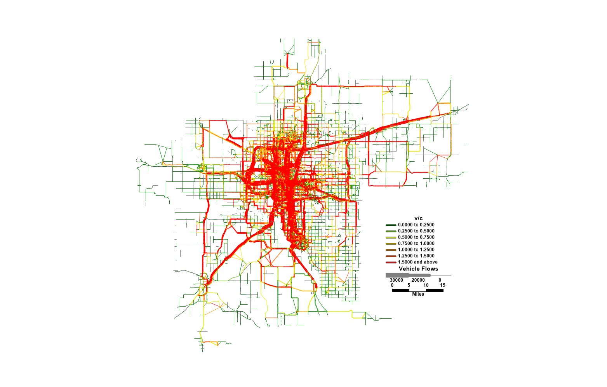

# **Appendix**
## A: Methodology and Sources
### *Demographics and Land Use Data*
For data about the population density, income, household size, and vehicle availability of we used 5-year Sample American Community Survey (ACS) Data from 2021. For information about the land use and employment we used Longitudinal Employer Household Dynamics (LEHD). For geographic boundaries we used census data.

### *Road Network*
To generate the Road Network we used data pulled from **Open Street Map**, downloaded through the service **https://extract.bbbike.org/.** We included in our road network all road segments labeled as motorways, motorway_links, secondary, tertiary,  trunks or unclassified roads. We decided to include the unclassified roads when we realized that major roads including US-77, US-62 were not included in motorways. Adding in unclassified roads also brought back in “boulevards,” such as Oklahoma City Boulevard and North Lincoln Boulevard. Our assumption is that since the original data did not label any roads as “primary,” many roads that would have been considered primary were instead labeled as unclassified.We then began to generate a transit skim using the software **Transcad.**

### *Public Transportation Network*
In this model we used General Transit Feed Specification (GTFS) data pulled from Oklahoma City [EMBARK's GTFS feed](https://embarkok.com/data/gtfs/google_transit.zip).

## B: Assumptions
### *Road Network*
1. All primary and secondary roads in rural areas are two-way roads even if coded as one-way roads in the OSM data. This assumption was based on cross-referencing against satellite images that indicated roads had bi-directional traffic despite being coded as one-ways in OSM. We identified rural areas by looking at the network and selecting areas that had large, mostly rectangular Transit Area Zones (TAZs). See Figure 3 for an image of primary or secondary road segments that we treated as rural two-ways. 

2. We made the following speed assumptions: 
* Unclassified road speeds are 30 mph
* Motorways are 60 mph
* Primary are 60 mph
* Secondary are 40 mph
* Tertiary are 30 mph
* Centroid Connectors are 15.

3. In our model we assumed that centroid connectors could model residential roads in each TAZ. In our model, centroid connectors can be up to 25 miles long, but must connect to a road no more than .1 miles outside of the zone boundary. Each centroid could have up to 7 centroid connectors. 

### *Transit Network*
1. The maximum initial wait time for a public transit trip was 15 minutes.
2. The walk speed for a traveler is 2.8 miles per hour.
3. Buses move at 30 miles per hour.
4. Centroid connectors could be a maximum of 0.5 miles long.

### *Accessibility Metrics*
1. We are weighting the portion of time spent waiting for a bus or train as 2.5 times the in-vehicle travel time (IVTT)

2. We are using a logistic decay function with an inflection point of 25 and standard deviation of 5 


## C: Supplemental Visualizations
### *Census and Employment Data*

<center>

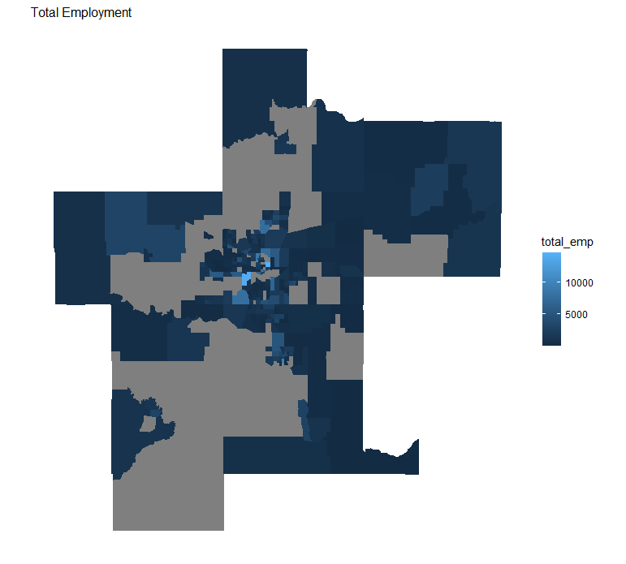{width=55%} 

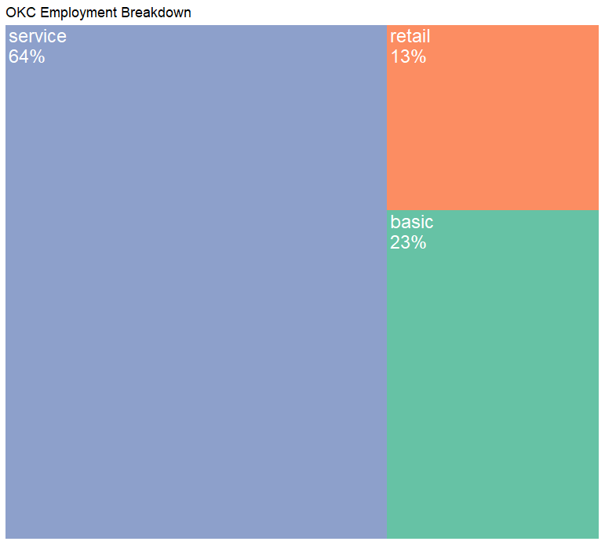{width=40%} 

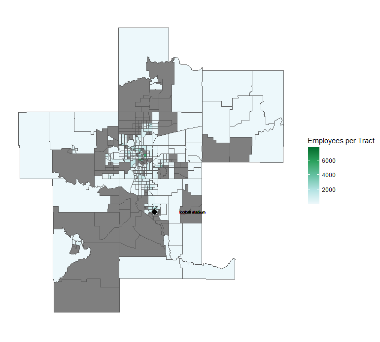{width=40%} {width=40%}

**Fig A3**: Employment + Activity Density is greatest in downtown OKC

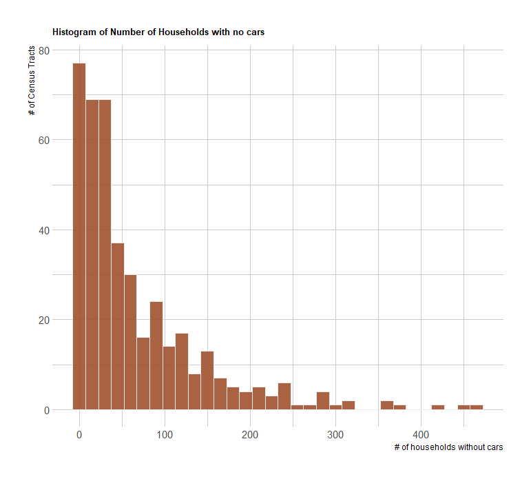{width=75%}  

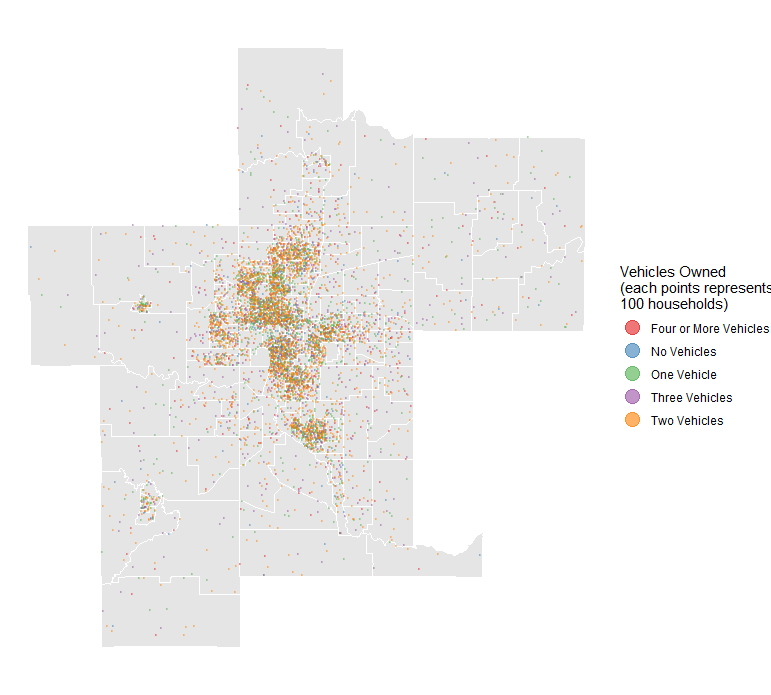{width=75%} 

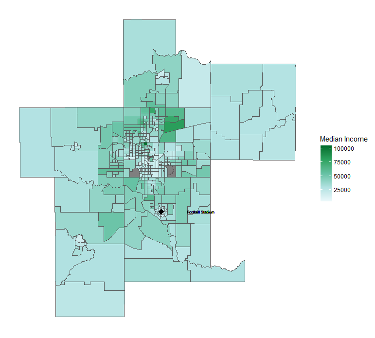

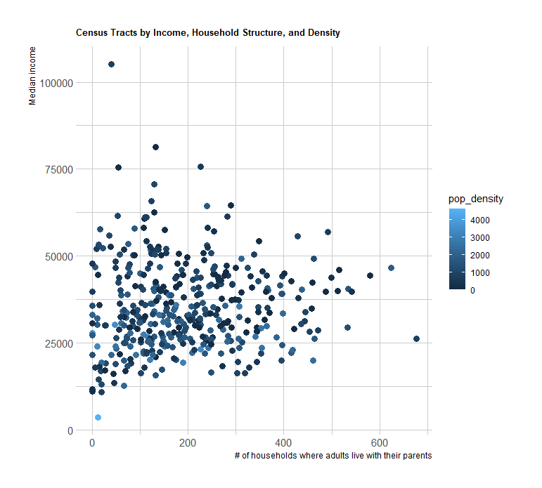 