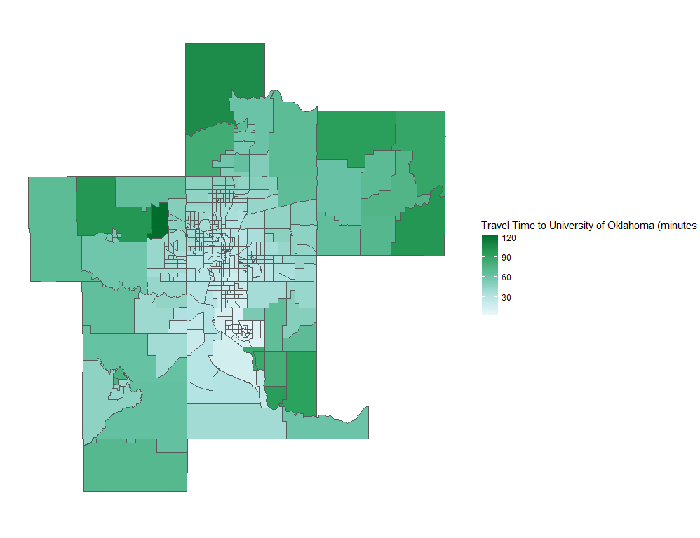

**Nur Shlapobersky**

**Sage Voorhees**

# **(A01):** Introduction

Oklahoma City is the capital of Oklahoma and the largest city in the state. At the 2020 Census, the OKC Metro area had a population just shy of 1.5 million (1,425,695)   (Census, 2020). 

In the 2021 American Community Survey (ACS), 62% of respondents reported their race as white, 10% African American, 8% Multiracial, 3% Native American, 3% Asian, 1% other (ACS 2018). 14% reported identifying as Hispanic (ACS 2018). Some well-known neighborhoods in OKC include Downtown, Bricktown (entertainment district), Deep Deuce (residential, formerly an African American neighborhood), The Arts District, Film Row, Midtown, Automobile Alley, Plaza District, Cottage District, Uptown, Asian District, Paseo Arts District, Crown-Heights-Edgemere Heights, Western Avenue Corridor, and 39th Street Enclave. 

Three major interstates--I-35, I-40, and I-44 all pass through OKC. 

{width=75%}

# **(A02):** Census and Employment Visualizations

## Household Characteristics

## Employment

## Density Maps

# **(A03):** Road Network Description

## Description of our Model’s Network 
In this model we used data pulled from Open Street Map, downloaded through the service https://extract.bbbike.org/. We included in our road network all road segments labeled as motorways, motorway_links, secondary, tertiary,  trunks or unclassified roads. We decided to include the unclassified roads when we realized that major roads including US-77, US-62 were not included in motorways. Adding in unclassified roads also brought back in “boulevards,” such as Oklahoma City Boulevard and North Lincoln Boulevard. Our assumption is that since the original data did not label any roads as “primary,” many roads that would have been considered primary were instead labeled as unclassified.   
  In our network we have 419 transit analysis zones. The longest distance between zones was  just over 3 hours and 15 minutes (190.5 minutes). The shortest distance was half a minute (0.5 minutes). The average distance between centroids is roughly 30 minutes (30.7). The median time between centroids was around 25 minutes (25.6 minutes). 

## Assumptions
In this model we made the following assumptions

1. All primary and secondary roads in rural areas are two-way roads even if coded as one-way roads in the OSM data. This assumption was based on cross-referencing against satellite images that indicated roads had bi-directional traffic despite being coded as one-ways in OSM. We identified rural areas by looking at the network and selecting areas that had large, mostly rectangular Transit Area Zones (TAZs). See image for an image of primary or secondary road segments that we treated as rural. 

2. We made the following speed assumptions: 
* Unclassified road speeds are 30 mph
* Motorways are 60 mph
* Primary are 60 mph
* Secondary are 40 mph
* Tertiary are 30 mph
* Centroid Connectors are 15.
3. In our model we assumed that centroid connectors could model residential roads in each TAZ. In our model, centroid connectors can be up to 25 miles long, but must connect to a road no more than .1 miles outside of the zone boundary. Each centroid could have up to 7 centroid connectors. 

Below is a chloropleth map which visualizes the travel times from each zone to the one containing the University of Oklahoma. 

# **(A04):** Transit Network Description

## Description of our Model’s Network 
In this model we used data pulled from Oklahoma City [EMBARK's GTFS feed](https://embarkok.com/data/gtfs/google_transit.zip). The network is composed of 651 miles of bus routes, across 30 different bus lines. The map below shows the bus network in detail, and in the context of the whole city:

  
  In our network we have 419 transit analysis zones. The transit network connects only 135 of those zones, with the longest travel time between zones being just over 3 hours and 15 minutes (190.5 minutes). The shortest distance was half a minute (0.5 minutes). The average distance between centroids is roughly 30 minutes (30.7). The median time between centroids was around 25 minutes (25.6 minutes). 

## Assumptions
In this model we made the following assumptions

1. The maximum initial wait time for a public transit trip was 15 minutes.
2. The walk speed for a traveler is 2.8 miles per hour.
3. Buses move at 30 miles per hour.
4. Centroid connectors could be a maximum of 0.5 miles long.

## Travel Times from the University of Oklahoma
Below is a chloropleth map showing the time it takes to travel to all reachable zone from the University of Oklahoma:

