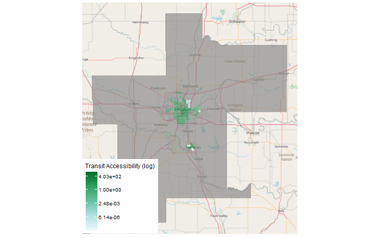
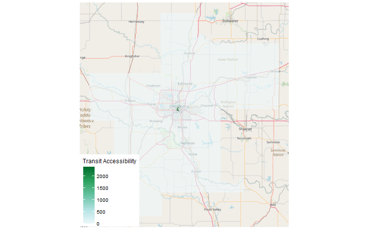
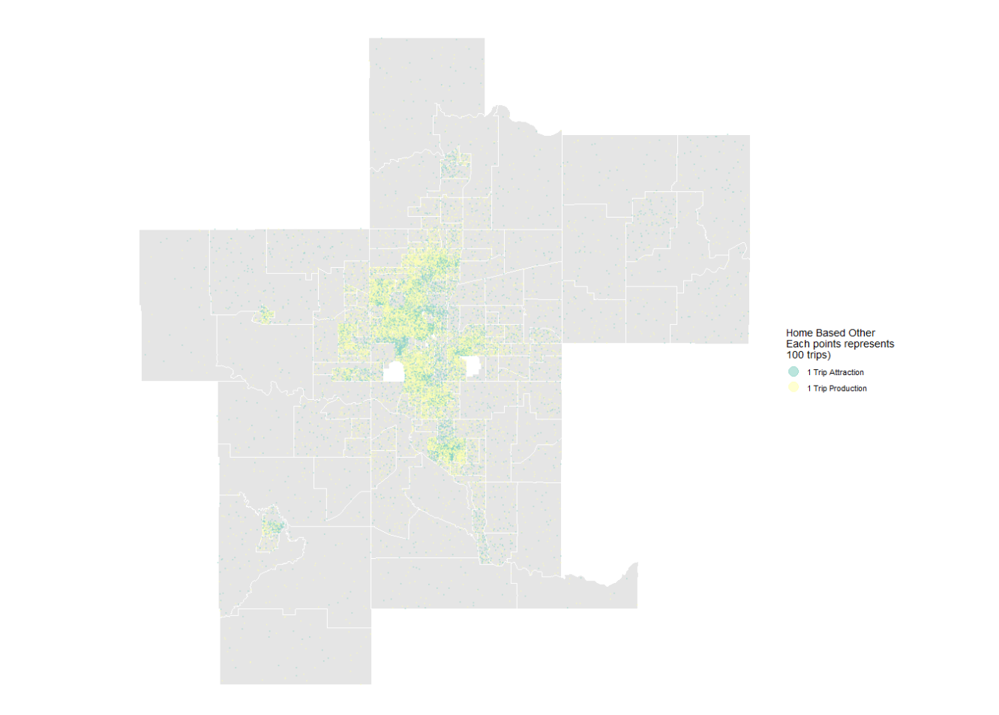
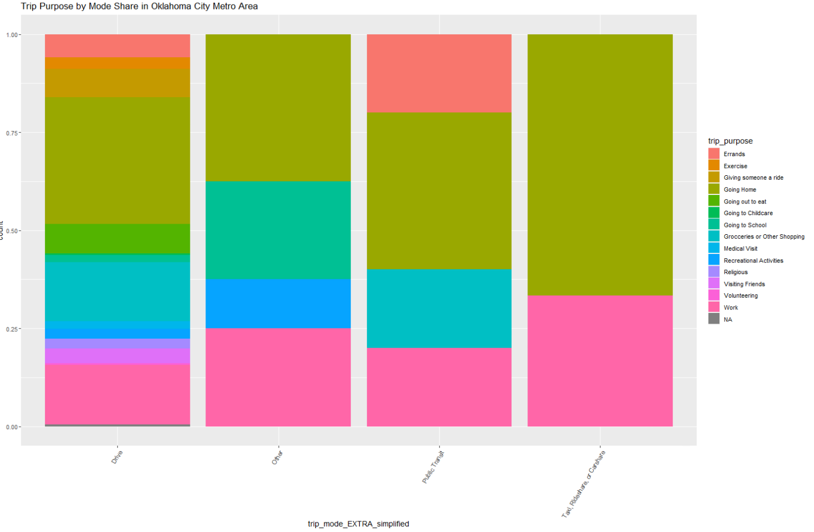
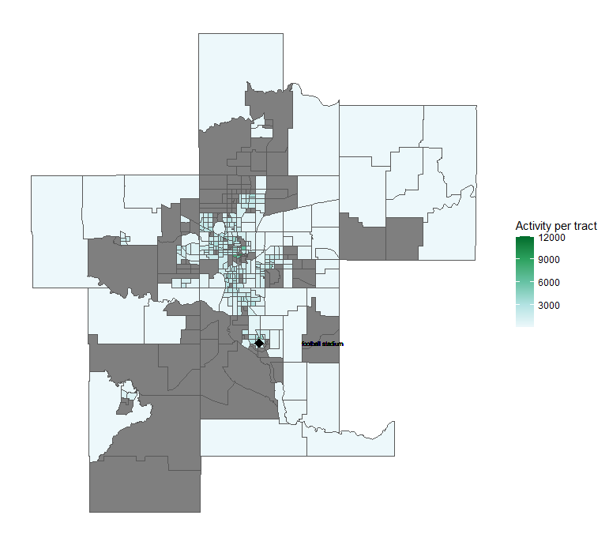

```{r setup, include=FALSE, echo=F, message=F, warning=F}
library(tufte)
library(viridis)
# invalidate cache when the tufte version changes
knitr::opts_chunk$set(
  cache.extra = packageVersion('tufte'),
  echo = F,
  message = F,
  warning = F,
  cache=T,
  dev.args=list(bg="transparent")
)
options(htmltools.dir.version = FALSE)

source("zone_visualization_sourced.R")
```

**Nur Shlapobersky** + **Sage Voorhees**  
SES 5394: Travel Behavior and Forecasting
Spring Semester 2023  

# Oklahoma City at a Glance

```{r okc-sketch, fig.cap="Sketch of Oklahoma City boundaries and interstate highways.", out.width="60%"}
knitr::include_graphics("../graphics/a1/OkC_Interstate_Sketch.png")
```

Oklahoma City is the capital of Oklahoma and the largest city in the state. Three major interstates--I-35, I-40, and I-44 all pass through OKC. As of the 2020 Census, the OKC Metro area is majority white, with a population just shy of 1.5 million people.^[2020 Census and 2021 American Community Survey]

::: {style="width:50%; margin-left:15%"}
| Race | Percent of Population |
| - | :-: |
| White | 62% |
| African American | 10% |
| Native American | 3% |
| Asian | 3% |
| Multi-racial | 8% |
| Other | 1% |
| -- | -- |
| Hispanic | 14% |
:::

Some well-known neighborhoods in OKC include

```{r bricktown, fig.margin=T, fig.cap="The Bricktown neighborhood.", fig.width=5}

```

- Downtown
- Bricktown - an entertainment district
- Deep Deuce - a residential, formerly African American neighborhood
- The Arts District
- Film Row
- Midtown
- Automobile Alley
- Plaza District
- Cottage District
- Uptown
- Asian District
- Paseo Arts District
- Crown-Heights-Edgemere Heights
- Western Avenue Corridor
- 39th Street Enclave


# Elements of the Model

``` {r num-households, fig.margin=T, fig.cap="Number of households by census tract", fig.dim=c(5,5)}
ggplot(zones) +
  geom_sf(aes(fill = total_hhsE)) +
  scale_fill_viridis(
    option = "mako",
    direction = -1,
    name = "# of Households",
    guide = map_colorbar
  ) +
  football_stadium() +
  theme_map() +
  theme(
    rect = element_rect(fill = "transparent"),
    legend.position=c(0.5,0)
  )
```

## Transit Analysis Zones


Our transportation analysis looks at 419 transit analysis zones across 7 counties, each corresponding to a census tract. In Figure \@ref(fig:num-households) we can see that Oklahoma City follows a typical greater metropolitan area pattern with a dense and active urban core, surrounded by suburbs and rural areas. The

## Road Network 

The longest distance between zones by car was just over 3 hours and 15 minutes (190.5 minutes). The shortest distance was half a minute (0.5 minutes). The average distance between TAZ centroids is roughly 30 minutes (30.7), the median time is around 25 minutes (25.6 minutes). Roads highlighted in red in Figure \@ref(fig:road-network) were modeled as two-way rural roads.

```{r road-network, fig.cap="\nThe modeled Oklahoma City road network.", fig.dim=c(10,10)}
knitr::include_graphics("../graphics/a3/modified_network.png")
```

## Public Transit Network

```{r transit-inset, fig.margin=T, fig.cap="Full county map with public transit.", fig.width=4}
ggplot() +
  geom_sf(data = OKC_tracts,
          fill = OKC_tracts$color,
          color = "gray") +
  geom_sf(data = route_shapes,
          aes(color = shape_id)) +
  theme_map() +
  theme(legend.position = "none")
```

The OKC Transit network is composed of 651 miles of bus routes, across 30 different bus lines. The map below shows the bus network in detail, and in the context of the whole city. Of our 419 transit analysis zones for OKC metro area, the transit network connects only 135 of those zones, with the longest travel time between zones being just over 3 hours and 15 minutes (190.5 minutes). The shortest distance was half a minute (0.5 minutes). The average distance between centroids is roughly 30 minutes (30.7). The median time between centroids was around 25 minutes (25.6 minutes). The public transit is fully contained in 3 of the 7 counties that make up the OKC statistical area. 

```{r transit-network, fig.cap="The public transit network in Oklahoma City.", fig.dim=c(8,8)}
ggplot() +
  geom_sf(data = OKC_transit_tracts,
          fill = "ivory2",
          color = "gray") +
  geom_sf(data = route_shapes,
          aes(color = shape_id),
          lwd=1.5) +
  theme_map() +
  theme(legend.position = "none")
```

## Travel Times
Using the networks we created, we generated travel time skims which provide travel times between every TAZ. By selecting a subset we can map every zone's travel time by car to the University of Oklahoma, as in Figure 5.

```{r uok-origin, fig.cap="Travel time by car from the University of Oklahoma", fig.dim=c(10,10)}
ggplot(uok_origin_skim) +
  geom_sf(aes(fill=car_time)) +
  scale_fill_viridis(
    option = "mako",
    direction = -1,
    name = "Car travel time (min)",
    guide = map_colorbar
  ) +
  theme_map() +
  theme(
    rect = element_rect(fill = "transparent"),
    legend.position=c(0.5,0)
  )
```

As well as the travel time by bus from the University to other zones, as in Figure 6 (note that many are grayed out because they cannot be reached by bus).

TODO: Something in this data isn't right

```{r uok-destination, fig.cap="Public transit travel time to the University of Oklahoma", fig.dim=c(10,10)}
ggplot(uok_dest_skim) +
  geom_sf(aes(fill=transit_time)) +
  scale_fill_viridis(
    option = "mako",
    direction = -1,
    name = "Transit travel time (min)",
    guide = map_colorbar
  ) +
  theme_map() +
  theme(
    rect = element_rect(fill = "transparent"),
    legend.position=c(0.5,0)
  )
```

# **Accessibility**

Accessibility is a measure of how many destination travelers can reach within a *perceived* reasonable time using transportation modes available to them. Put an alternative, and slightly more mathematical way:

`r tufte::margin_note("Mobility: reasonable reachable area")`
`r tufte::margin_note("Proximity: opportunities per area")`
$$accessibility = mobility * proximity$$

We determine accessibility based on the network skims mentioned earlier and employment data. Travel times are used in a decay function to scale the "worth" of each opportunity, and these are all summed together to determine the accessibility score. See Appendix B for more information.

## Accessibility by Car
Car access is distributed as is typical for a metropolitan area: the downtown, being both dense and centrally located, has higher scores than the outlying areas. 

<center>

</center>

While they don't necessarily represent a large percent of the land area, there are many of those downtown high-scoring zones because they are smaller, and this is what forms the right peak in the distribution shown in Figure 8. The left peak represents the outlying rural zones.

<center>

</center>

## Accessibility by Transit
Transit in Oklahoma City is quite limited to the areas in and around Downtown and the University campus. The bus lines between the two areas notably bypass most of the zones in between, creating the two island-like regions in Figure 9.

<center>

</center>

Taking a look at the accessibility map without using a log transformation in Figure 10, we can see that the majority of those zones have very similar low scores. There are just a few outliers with much higher accessibility scores due to the proximity of transit hubs where many of the bus lines meet.

<center>

</center>

Those outliers can also be seen in Figure 11 at the far right tail of the distribution.  

<center>

</center>

# **Trip Attractions and Trip Productions** 


**Estimating Productions and Attractions** 
Data for our analysis of Trip Attractions and Productions comes from the National Household Travel Survey (NHTS) from 2017. 

To generate Trip Attractions and Trip Productions for each transit analysis zones, we broke up trip types into three main categories. 

1. Home Based Work: Travel between work and home 
2. Home Based Other: Travel between home and places other than a workplace
3. Non-Home Based: Travel that does not start or end at home

To generate our trip attractions and productions we conducted a linear regression using factors present in both the NHTS and the ACS. 

We used: 


  1. Median Income (Continuous)
  2. Whether or not the household had a vehicle (yes, no)
  3. Household size (1 person, 2 people, 3 people, 4 or more people)
  4. Whether or not the household had kids (yes, no)
  
We had a very low R-Squared value in our regressions ranging from .124 to .129. In our regressions, only household size and presence of kids was statistically significant, so we only used these variables to generate trip attractions and productions. 

#### Totals for Trip Productions and Attractions
**Home Based Work:** 124,464  
**Home Based Other:** 1,392,300  
**Non Home Based:** 1,618,000  


<center>

</center>


<center>

</center>

We also used NHTS data to examine mode share in OKC based on various trip types. 

<center>

</center>

<center>

</center>

<center>

</center>


# (APPENDIX) Appendix {-}
## A: Methodology and Sources
### Demographics and Land Use Data
For data about the population density, income, household size, and vehicle availability of we used 5-year Sample American Community Survey (ACS) Data from 2021. For information about the land use and employment we used Longitudinal Employer Household Dynamics (LEHD). For geographic boundaries we used census data.

### Road Network
To generate the Road Network we used data pulled from **Open Street Map**, downloaded through the service **https://extract.bbbike.org/.** We included in our road network all road segments labeled as motorways, motorway_links, secondary, tertiary,  trunks or unclassified roads. We decided to include the unclassified roads when we realized that major roads including US-77, US-62 were not included in motorways. Adding in unclassified roads also brought back in “boulevards,” such as Oklahoma City Boulevard and North Lincoln Boulevard. Our assumption is that since the original data did not label any roads as “primary,” many roads that would have been considered primary were instead labeled as unclassified.We then began to generate a transit skim using the software **Transcad.**

### *Public Transportation Network*
In this model we used General Transit Feed Specification (GTFS) data pulled from Oklahoma City [EMBARK's GTFS feed](https://embarkok.com/data/gtfs/google_transit.zip).

## B: Assumptions
### *Road Network*
1. All primary and secondary roads in rural areas are two-way roads even if coded as one-way roads in the OSM data. This assumption was based on cross-referencing against satellite images that indicated roads had bi-directional traffic despite being coded as one-ways in OSM. We identified rural areas by looking at the network and selecting areas that had large, mostly rectangular Transit Area Zones (TAZs). See Figure 3 for an image of primary or secondary road segments that we treated as rural two-ways. 

2. We made the following speed assumptions: 
* Unclassified road speeds are 30 mph
* Motorways are 60 mph
* Primary are 60 mph
* Secondary are 40 mph
* Tertiary are 30 mph
* Centroid Connectors are 15.

3. In our model we assumed that centroid connectors could model residential roads in each TAZ. In our model, centroid connectors can be up to 25 miles long, but must connect to a road no more than .1 miles outside of the zone boundary. Each centroid could have up to 7 centroid connectors. 

### *Transit Network*
1. The maximum initial wait time for a public transit trip was 15 minutes.
2. The walk speed for a traveler is 2.8 miles per hour.
3. Buses move at 30 miles per hour.
4. Centroid connectors could be a maximum of 0.5 miles long.

### *Accessibility Metrics*
1. We are weighting the portion of time spent waiting for a bus or train as 2.5 times the in-vehicle travel time (IVTT)

2. We are using a logistic decay function with an inflection point of 25 and standard deviation of 5 


## C: Supplemental Visualizations
### *Census and Employment Data*

``` {r total-jobs, fig.cap="Employment is concentrated in the downtown area. Employment information is not available for many of our Transit Analysis Zones", fig.dim=c(5,5)}
ggplot(zones) +
  geom_sf(aes(fill = total_emp)) +
  scale_fill_viridis(
    option = "mako",
    direction = -1,
    name = "Total Jobs",
    guide = map_colorbar
  ) +
  theme_map() +
  theme(
    rect = element_rect(fill = "transparent"),
    legend.position=c(0.5,0)
  )
```

``` {r employment-tree, fig.cap="Majority of employment in OKC metro area is in the service industry.", fig.dim=c(5,5)}
ggplot(total_employment_type, aes(area = pct, fill = emp_type)) +
  geom_treemap(show.legend = FALSE, color = NA) +
  geom_treemap_text(aes(label = paste(
    emp_type, "\n",
    prettyNum(pct * 100, digits = 1),
    "%", sep = ""
  )),
  color = "#fffff8") +
  scale_fill_brewer(palette = "Set2") +
  ggtitle("OKC Employment Breakdown")
```
{width=40%} 

{width=40%} {width=40%}

**Fig A3**: Employment + Activity Density is greatest in downtown OKC

{width=75%}  

{width=75%} 

``` {r median-income, fig.cap="Highest income neighborhoods are north of downtown.", fig.dim=c(5,5)}
ggplot(zones) +
  geom_sf(aes(fill = median_incomeE)) +
  scale_fill_viridis(
    option = "mako",
    direction = -1,
    name = "Median Income",
    guide = map_colorbar
  ) +
  theme_map() +
  theme(
    rect = element_rect(fill = "transparent"),
    legend.position=c(0.5,0)
  )
```

``` {r income-density-structure-scatter, fig.cap="Census tracts by income, population density, and # of adults Living with their parents.", fig.dim=c(8,5)}
ggplot(zones,
       aes(x = total_18to34E, y = median_incomeE, color = pop_density)) +
  geom_point(size = 3) +
  xlab("# of households where adults live with their parents") +
  ylab("Median income") +
  theme_ipsum() +
  theme(plot.title = element_text(size = 10))
```